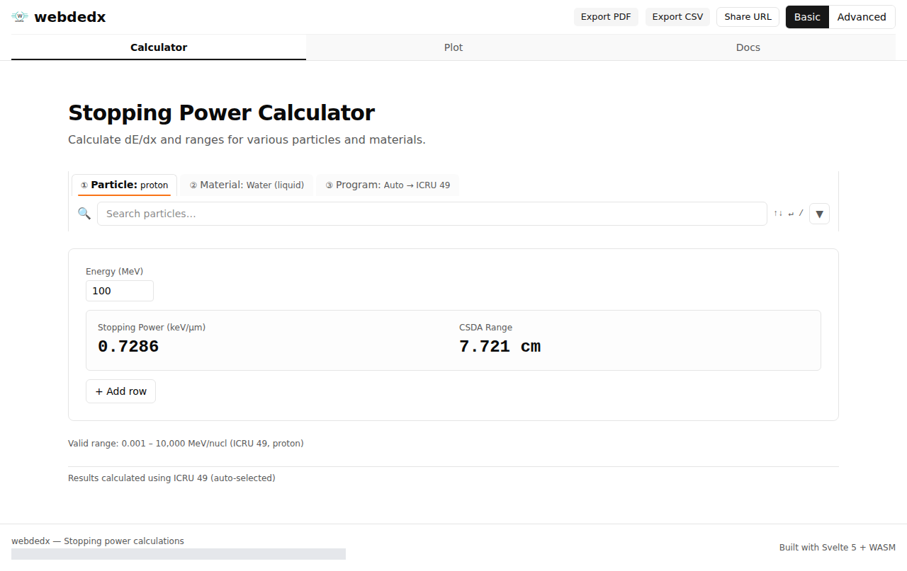
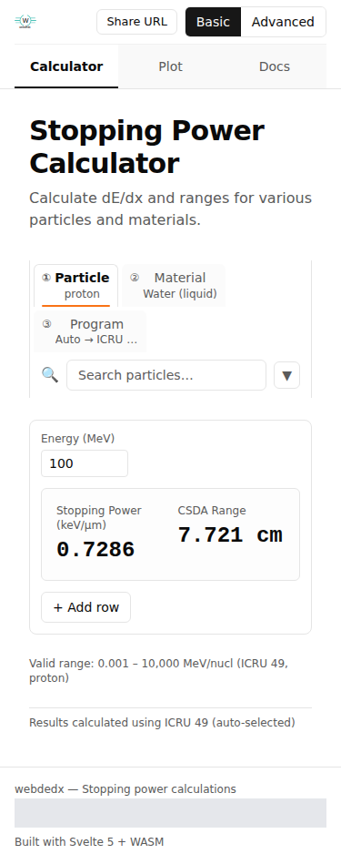
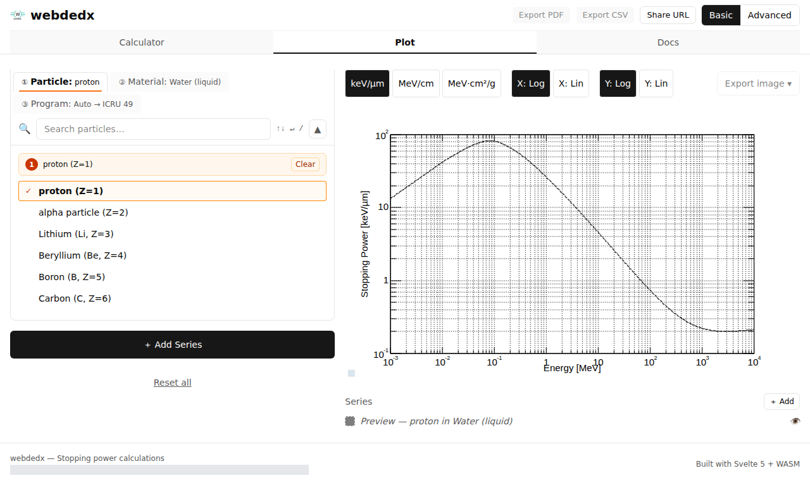

# dEdx Web — Quick User Guide

A two-minute tour of **webdedx**, the browser app for stopping-power (dE/dx)
and range calculations. No install required — everything runs locally in your
browser via WebAssembly.

> The screenshots below are generated automatically with Playwright
> (`pnpm docs:screenshots`, see [issue #594](https://github.com/APTG/dedx_web/issues/594)),
> so they always reflect the current UI.

---

## 1. Calculator

Open the **Calculator** tab to compute stopping power and CSDA range for a
single energy or a list of energies.

1. **Pick a particle** (e.g. `proton`), a **material** (e.g. `Water (liquid)`),
   and a **program**. Leaving the program on `Auto` lets the app choose a
   compatible one (here, ICRU 49).
2. **Enter an energy** in the input field. Results update instantly — at
   100 MeV a proton in liquid water gives a stopping power of `0.7286 keV/µm`
   and a CSDA range of `7.721 cm`.
3. **+ Add row** to compare several energies at once.
4. Switch **Basic → Advanced** (top right) for density / I-value overrides,
   inverse lookups (energy from range or stopping power), and multi-entity
   comparisons.
5. **Export PDF / CSV** or **Share URL** — the full app state lives in the URL,
   so a link reproduces exactly what you see.

The layout is fully responsive and works on a phone:

---

## 2. Plot

The **Plot** tab draws stopping power (or range) versus energy as an
interactive curve.

1. Choose the particle/material as in the calculator.
2. Toggle the **Y unit** (`keV/µm`, `MeV/cm`, `MeV·cm²/g`) and **log / linear**
   axes with the buttons above the chart.
3. **+ Add Series** to overlay several particles or materials for comparison.
4. **Export image** to save the chart as PNG.

---

## Tips

- **Shareable URLs** — bookmark or send any calculator/plot state; the link
  restores particle, material, program, energies, units, and advanced options.
- **Units** — stopping-power and energy units can be changed from the column
  headers / axis toggles; conversions are applied at display time.
- **Offline** — once loaded, calculations run entirely in your browser.

For the full feature reference see the [feature specs](04-feature-specs/) and
the in-app **Docs** section.
